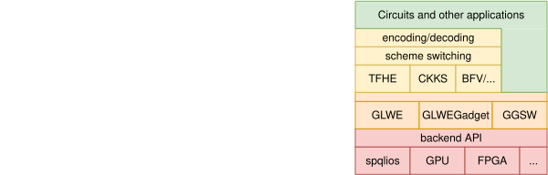

# prividema-fhe

Prividema-fhe is a cryptographic library designed to unify multiple homomorphic encryption schemes under a single framework.
When complete, it will contain:

- A modular backend system that can efficiently delegate raw computations to:
  - CPU libraries like [spqlios-arithmetic](https://github.com/tfhe/spqlios-arithmetic), that, for example, use AVX extensions
  - GPU libraries
  - FPGAs
  - ...
- A core implementing bivariate (base-2K) polynomial arithmetic and
  implementations of GLWE, GLWEGadget and GGSW using said arithmetic
- A scheme layer implementing:
  - HEIntegers (HEInt)
  - HEBits
  - HEFixedPoint (HEFP)
  - Scheme-switching between the above (CHIMERA) [\[3\]]
  - Encoding and decoding functions from raw data to/from the polynomial representations that the schemes use

## Bivariate (base-2K) polynomial representation

FHE relies on efficient number representations and operations to achieve secure and high-performance computations. Two prominent approaches, Full-RNS (Residue Number System) and base-2^K (written as base-2K in this markdown document for better readability) representation, have evolved as key techniques in optimizing FHE computations.

Full-RNS exploits the Chinese Remainder Theorem (CRT) to represent large numbers as modular residues over small, machine-friendly primes.
Historically, this representation has also consistently given the best performances and this is why it is used in most of the most prominent FHE libraries like [OpenFHE] or [Lattigo].
However, Full-RNS has notable limitations:

- Prime Arithmetic Dependency: Modular arithmetic must handle computations across several primes, introducing inefficiencies in hardware optimization.
- Noise Granularity: CRT-based representations lack fine-grained control over noise levels, limiting their adaptability for low-noise operations.
- Complex Scaling: Modulus switching and truncation require additional steps, complicating transitions between precision levels.

Although the benefits of RNS once outweighed the drawbacks compared to other representation systems, the situation has shifted in recent years.
First, Kim et al [\[2\]] introduced the concept of double-gadget decomposition, which allows for more efficient external products.
The core idea is to decompose _both_ operands of the product such that some of the operations can be performed in Z\[X\]/(X^N+1)
directly instead of modulo a large prime Q.

This significantly reduces the number of (unit) discrete Fourier transforms (DFTs) necessary for the external product, from quadratic to linear in the ciphertext level.
The new method is particularly impactful for key-switching operations, achieving speedups of 1.2–2.3x and 2.1–3.3x over previous methods for different ring dimensions.
Building on this concept, Georgieva et al. [\[1\]] presented the notions of _base-2K_ and bivariate polynomial representations.
This library implements these novel techniques.

In base-2K, large numbers are decomposed as sums of smaller "limbs" or "digits", each of which is a multiple of a power of 2^K.
More precisely, any number X can be decomposed as follows:

where $x_i$ are the limbs, each of which is a small integer (typically within the range $[-2^{K-1}, 2^{K-1})$,
$K$ is the limb size and $\ell$ is the number of limbs, which depends on the precision required.

In order to make the analysis of the base-2K representation easier and to make it more generic, Georgieva et al. [\[1\]] introduce the _Bivariate Polynomial Representation_.
The idea is to represent approximation of polynomials in R\[X\]/(X^N+1) by elements of
Z\[X,Y\]/(X^N+1) evaluated at some limb basis (e.g. 2^K to fall back to the base-2K case).

The main advantages of the base-2K/bivariate representation are:

- faster computation of the external product (linear in terms of (i)DFT computations)
- fastest modulus rescale (we can simply drop limbs)
- use of base-2, which is easier to optimize on hardware

On the other hand, compared to RNS, base-2K has

- slower multiplication because of carry propagation
- larger keys because of the double decomposition

In particular, it means that the BGV/BFV/CKKS-like products $\otimes_*$ can be slightly slower in bivariate representation. In isolation, base-2K multiplication is still faster as a multiplication is followed by an external product and a rescaling, which are faster in the latter representation.

## Library Structure

The library is to be divided in the following layers:

- Backend : will contain an abstraction layer over the underlying library or hardware that is used for heavy optimisation.
  At present only spqlios is supported
- Common: Utility code, functions that belong to no particular scheme/problem/FHE concept.
-Core: Where the code for basic mathematical constructs will go
  - GLWE: functions and code for GLWE operations
  - GGSW: functions and code for GGSW and (related) GLWEGadget opeartions
- Schemes: The different FHE schemes that can be implemented using the above problems
  
Its implementation in C allows for close-to-the metal optimisations
and maximum portability, due to the spread of C toolchains as well
as ability to call C functions (via an FFI) from most other programming languages.
Additionally, the library is structured in different layers that can be imported
independently, providing the developer a choice on the level of abstraction
that their application requires.

## Security

Prividema-fhe implements RLWE- and GLWE-based cryptographic primitives and follows the standard IND-CPA security model when configured with appropriate parameters.

To ensure adequate security levels, parameter selection should be performed carefully according to the target use case and security requirements. We recommend using the [Lattice Estimator](https://github.com/malb/lattice-estimator) to evaluate and validate parameter choices against known lattice attacks

## Building

Instructions for building the library can be found in [BUILDING.md](BUILDING.md).

## Testing and benchmarks

The library currently contains both a test suite and some benchmarks.
The tests are implemented using the Criterion C framework and most of them have parametrized problem parameters (N, K, etc.).
The benchmarks require a relatively modern C++ compiler as they use Google's benchmark library.

The instructions can also be found in [BUILDING.md](BUILDING.md).

## Docker

A Docker image for building and testing the library will be provided in the future.

## References

[\[1\]]: https://eprint.iacr.org/2023/771

[\[2\]]: https://eprint.iacr.org/2023/413

[\[3\]]: https://eprint.iacr.org/2018/758

[OpenFHE]: https://openfhe.org/

[Lattigo]: https://github.com/tuneinsight/lattigo

\[1\] Mariya Georgieva Belorgey, Sergiu Carpov, Nicolas Gama, Sandra Guasch, and Dimitar
Jetchev. Revisiting key decomposition techniques for fhe: Simpler, faster and more generic.
In International Conference on the Theory and Application of Cryptology and Information
Security, pages 176–207. Springer, 2024

\[2\] Miran Kim, Dongwon Lee, Jinyeong Seo, and Yongsoo Song. Accelerating HE operations
from key decomposition technique. In Helena Handschuh and Anna Lysyanskaya, editors,
CRYPTO 2023, Part IV, volume 14084 of LNCS, pages 70–92, Santa Barbara, CA, USA,
August 20–24, 2023. Springer, Cham, Switzerland.

\[3\] Christina Boura, Nicolas Gama, Mariya Georgieva, and Dimitar Jetchev. Chimera:
Combining ring-lwe-based fully homomorphic encryption schemes.
Journal of Mathematical Cryptology, 14(1):316–338, 2020.
